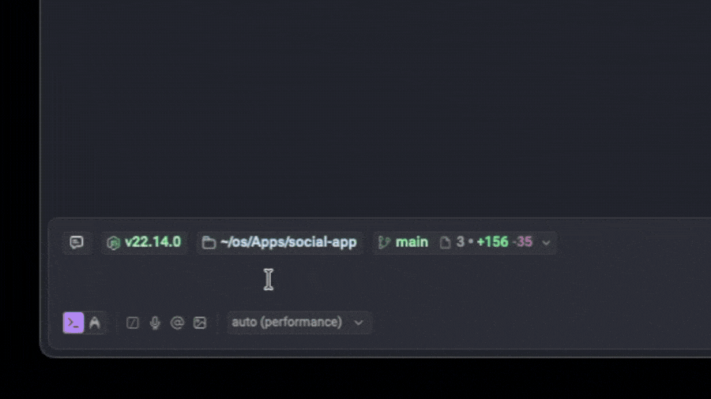

# npm-peek 🔍 [![npm][npm-image]][npm-url] ![npm][npm-dl-stats]

A CLI tool that lets you visually compare your installed npm package versions with any available release. Autocomplete helps you select a package, then pick a version to visually diff against your current one.

## 🚀 Quick Start

Use npm-peek instantly with npx:

```bash
# Interactive mode with autocompletion using your package.json
npx npm-peek

# Direct comparison mode with specific package & version
npx npm-peek react --target 19.1.0
```

## 🎥 Showcase



## ✨ Key Features

- **Smart Dependency Detection:** Automatically finds and lists all packages from your `package.json`
- **Fuzzy Search:** Quickly locate packages with partial name matching
- **Version Autocomplete:** Easily select from all available versions of a package
- **Visual Diff Viewer:** See all changes in a clean, browser-based HTML interface
- **One-Command Operation:** Compare versions with minimal typing
- **Zero Configuration:** Works out-of-the-box with any npm project

## 🔧 How It Works

1. Reads `package.json` to identify dependencies and used version
2. Prompts you to select a package and target version (with autocomplete)
3. Generates a visual diff
4. Opens the diff in your default browser

[npm-image]: https://img.shields.io/npm/v/npm-peek
[npm-url]: https://www.npmjs.com/package/npm-peek
[npm-dl-stats]: https://img.shields.io/npm/dm/npm-peek
