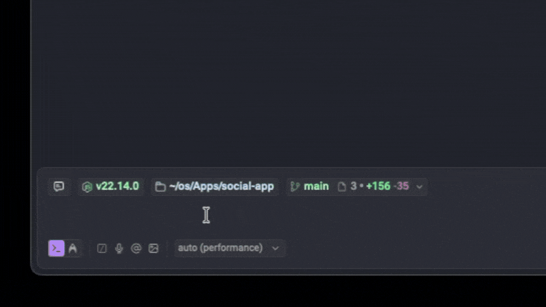

# npm-peek 🔍 [![npm][npm-image]][npm-url] ![npm][npm-dl-stats]

`npm-peek` is a CLI for reviewing dependency upgrades before you bump them.
Run it inside a project, pick a dependency from your `package.json`, choose a target version, and it will generate a browser-friendly HTML diff of what actually changed.

## Why Use It

Dependency upgrades usually start with a vague question: "Is this update small, risky, or breaking?"

`npm-peek` answers that by showing the real package diff between the version you currently have installed and the version you want to inspect.

- Review an upgrade before changing your lockfile
- Compare your installed version against any published release
- Start from your existing `package.json` and `node_modules`
- Open a readable HTML diff instead of digging through tarballs manually

## Quick Start

```bash
# Pick a dependency from the current project's package.json
npx npm-peek

# Skip package selection and choose only the target version
npx npm-peek react

# Compare directly against a specific release
npx npm-peek react --target 19.1.0
```

## Showcase



## How It Works

1. Reads dependencies from the current project's `package.json`
2. Detects the installed version from `node_modules`
3. Lets you pick any published target version
4. Runs `npm diff` for the two versions
5. Opens the result as an HTML diff in your browser

When repository metadata is available, `npm-peek` also prints compare and release links for the upstream repo.

## Requirements

- Run it inside a project directory with a `package.json`
- Install dependencies first so the package exists in `node_modules`
- Have `npm` available locally

## CLI Usage

```bash
npx npm-peek [package-name] [--target <version>] [--exp]
```

- No package name: interactive dependency picker
- Package name only: interactive target version picker
- Package name plus `--target`: direct comparison
- `--exp`: use the faster experimental HTML renderer

## What You Get

- The version range declared in your `package.json`
- The version actually installed in `node_modules`
- A file-level diff for the selected upgrade path
- A browser-based view that is easier to scan than raw terminal diff output

[npm-image]: https://img.shields.io/npm/v/npm-peek
[npm-url]: https://www.npmjs.com/package/npm-peek
[npm-dl-stats]: https://img.shields.io/npm/dm/npm-peek
